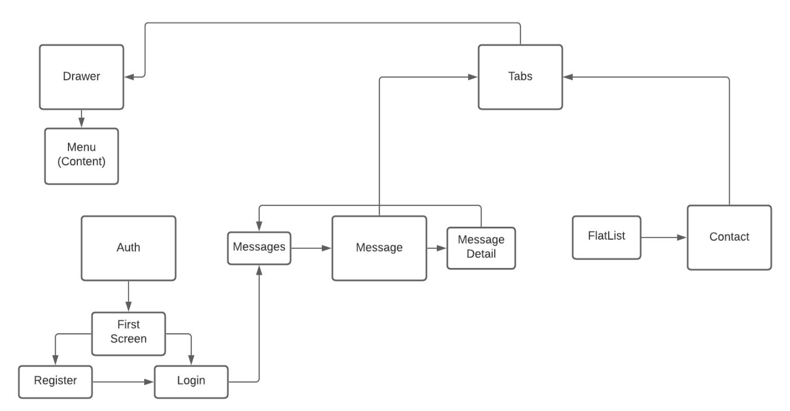

# VChat

VChat is a simple messaging application.

 

## Project Structure

#### Authentication part was handled using two simple pages that are login and register pages.
#### Message component includes one main sub-component that lists messages, and inside this sub-component, a message detail component were added that displays the message content.
#### Contacts component created using the FlatList component.
#### In the Profile component, a drawer structure was used that includes profile picture, user name, and email address.

 

## Technologies

#### [React Native](https://reactnative.dev/)
#### [Redux](https://redux.js.org/)
#### [Redux-Thunk](https://github.com/reduxjs/redux-thunk)
#### [React Navigation](https://reactnavigation.org/)
#### [Firebase](https://firebase.google.com/)

 

## Features

#### Initial page of application
#### Authentication (login and register) pages
#### Profile page
#### Message page
#### Contact page
#### Drawer and tab structure
#### Messages with texts and images
#### Image picker for profile picture and message

 

## Photos from the Application

&nbsp; &nbsp; &nbsp; &nbsp; &nbsp; &nbsp; &nbsp; &nbsp; 

 

&nbsp; &nbsp; &nbsp; &nbsp; &nbsp; &nbsp; &nbsp; &nbsp; 

 

## Todos

#### Favourite contacts list
#### Group messaging
#### Audio and video call
#### Light and dark view mode switcher
#### Message dates
